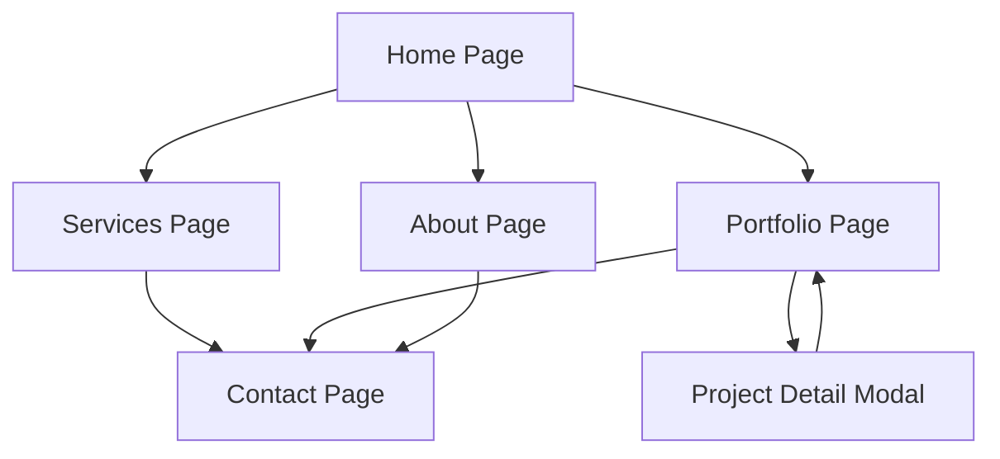

# Edwaldo Utama Portfolio Website - Product Requirements Document

## 1. Product Overview
A modern, professional portfolio website for Edwaldo Utama, showcasing development skills and experience through an elegant dark-themed interface inspired by contemporary design trends.

The website serves as a digital business card and project showcase, targeting potential clients, employers, and collaborators in the tech industry. It emphasizes clean aesthetics, smooth user experience, and professional presentation to establish credibility and attract opportunities.

## 2. Core Features

### 2.1 User Roles
No user role distinction is necessary for this portfolio website - all visitors have the same access level to view content and contact information.

### 2.2 Feature Module
Our portfolio website consists of the following main pages:
1. **Home page**: hero section with personal introduction, navigation menu, skills overview, featured projects preview.
2. **Services page**: detailed service offerings, skill percentages, expertise areas.
3. **Portfolio page**: project showcase with filtering, detailed project cards, case studies.
4. **About page**: personal story, professional journey, downloadable CV.
5. **Contact page**: contact form, social media links, availability status.

### 2.3 Page Details

| Page Name | Module Name | Feature description |
|-----------|-------------|---------------------|
| Home page | Hero section | Display professional introduction with name "Edwaldo Utama", title, location, animated typing effect for roles |
| Home page | Navigation | Sticky header with smooth scroll navigation, mobile hamburger menu, dark theme toggle |
| Home page | Stats section | Years of experience counter, projects completed, client satisfaction metrics |
| Home page | Featured projects | Preview of 3-4 best projects with hover effects and quick view options |
| Services page | Skills showcase | Interactive skill bars showing proficiency percentages (UI/UX Design, Development, etc.) |
| Services page | Service cards | Detailed service offerings with icons, descriptions, and pricing information |
| Portfolio page | Project gallery | Filterable project grid with categories, search functionality, lazy loading |
| Portfolio page | Project details | Modal or dedicated pages for project case studies with images, tech stack, live demos |
| About page | Personal story | Professional journey timeline, education, certifications, personal interests |
| About page | CV download | Downloadable resume button with PDF generation |
| Contact page | Contact form | Functional contact form with validation, email integration, success/error states |
| Contact page | Social links | Links to GitHub, LinkedIn, Twitter, and other professional profiles |

## 3. Core Process

The main user journey follows a discovery and engagement flow:

1. **Discovery Flow**: Visitor lands on homepage → Views hero section and gets immediate impression → Scrolls through skills and featured projects → Navigates to specific sections based on interest

2. **Exploration Flow**: Visitor explores services to understand capabilities → Browses portfolio to see work quality → Reads about section for personal connection → Contacts for potential collaboration

## 4. User Interface Design

### 4.1 Design Style
- **Primary colors**: Deep dark background (#0a0a0a), accent green (#64ffda), white text (#ffffff)
- **Secondary colors**: Dark gray (#1a1a1a), medium gray (#333333), light gray (#666666)
- **Button style**: Rounded corners (8px), gradient hover effects, smooth transitions
- **Typography**: Modern sans-serif font (Inter or similar), 16px base size, varied weights
- **Layout style**: Card-based design, generous whitespace, grid layouts, sticky navigation
- **Icons**: Minimalist line icons, consistent stroke width, subtle animations on hover

### 4.2 Page Design Overview

| Page Name | Module Name | UI Elements |
|-----------|-------------|-------------|
| Home page | Hero section | Full-height section, centered content, animated background particles, profile image with border effects |
| Home page | Navigation | Transparent background with blur effect, smooth scroll indicators, mobile-responsive hamburger |
| Services page | Skills section | Animated progress bars, percentage counters, icon representations, card-based layout |
| Portfolio page | Project grid | Masonry or grid layout, hover overlay effects, category filter buttons, search input |
| About page | Timeline | Vertical timeline with milestone markers, expandable content sections, smooth animations |
| Contact page | Form design | Floating labels, validation states, submit button with loading animation, success confirmation |

### 4.3 Responsiveness
The website is mobile-first and fully responsive, optimized for touch interactions on tablets and smartphones. Breakpoints at 768px (tablet) and 1024px (desktop) ensure optimal viewing across all devices. Navigation transforms to hamburger menu on mobile, and grid layouts adapt to single-column on smaller screens.