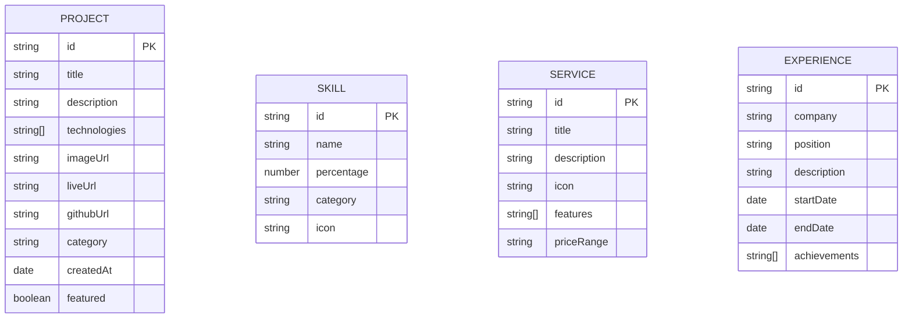

# Edwaldo Utama Portfolio Website - Technical Architecture Document

## 1. Architecture Design


## 2. Technology Description

* **Frontend**: SvelteKit\@2 + TypeScript + Vite

* **Styling**: Tailwind CSS\@3 + PostCSS

* **Animations**: Framer Motion for Svelte + GSAP\@3

* **Icons**: Lucide Svelte + Heroicons

* **Forms**: Svelte Forms Lib + Yup validation

* **Email**: EmailJS or Formspree integration

* **Deployment**: Static site generation with Vercel adapter

## 3. Route Definitions

| Route              | Purpose                                                            |
| ------------------ | ------------------------------------------------------------------ |
| /                  | Home page with hero section, skills preview, and featured projects |
| /services          | Services and skills showcase with detailed capabilities            |
| /portfolio         | Complete project gallery with filtering and search                 |
| /portfolio/\[slug] | Individual project detail pages with case studies                  |
| /about             | Personal story, timeline, and downloadable CV                      |
| /contact           | Contact form and social media links                                |
| /api/contact       | Server endpoint for contact form submission (if needed)            |

## 4. API Definitions

### 4.1 Core API

Contact form submission

```
POST /api/contact
```

Request:

| Param Name | Param Type | isRequired | Description            |
| ---------- | ---------- | ---------- | ---------------------- |
| name       | string     | true       | Sender's full name     |
| email      | string     | true       | Sender's email address |
| subject    | string     | true       | Message subject line   |
| message    | string     | true       | Message content        |
| honeypot   | string     | false      | Spam protection field  |

Response:

| Param Name | Param Type | Description       |
| ---------- | ---------- | ----------------- |
| success    | boolean    | Submission status |
| message    | string     | Response message  |

Example Request:

```json
{
  "name": "John Doe",
  "email": "john@example.com",
  "subject": "Project Inquiry",
  "message": "I'd like to discuss a potential project..."
}
```

Example Response:

```json
{
  "success": true,
  "message": "Thank you for your message. I'll get back to you soon!"
}
```

## 5. Data Model

### 5.1 Data Model Definition



### 5.2 Data Definition Language

Since this is a static portfolio website, data will be stored in JSON/TypeScript files rather than a database:

**Projects Data (src/lib/data/projects.ts)**

```typescript
export interface Project {
  id: string;
  title: string;
  description: string;
  longDescription?: string;
  technologies: string[];
  imageUrl: string;
  images?: string[];
  liveUrl?: string;
  githubUrl?: string;
  category: 'web' | 'mobile' | 'desktop' | 'design';
  createdAt: string;
  featured: boolean;
}

export const projects: Project[] = [
  {
    id: 'project-1',
    title: 'E-commerce Platform',
    description: 'Modern e-commerce solution with advanced features',
    technologies: ['Svelte', 'TypeScript', 'Tailwind CSS', 'Stripe'],
    imageUrl: '/images/projects/ecommerce.jpg',
    liveUrl: 'https://example.com',
    githubUrl: 'https://github.com/edwaldo/project',
    category: 'web',
    createdAt: '2024-01-15',
    featured: true
  }
  // ... more projects
];
```

**Skills Data (src/lib/data/skills.ts)**

```typescript
export interface Skill {
  id: string;
  name: string;
  percentage: number;
  category: 'frontend' | 'backend' | 'design' | 'tools';
  icon: string;
}

export const skills: Skill[] = [
  {
    id: 'skill-1',
    name: 'UI/UX Design',
    percentage: 95,
    category: 'design',
    icon: 'palette'
  },
  {
    id: 'skill-2',
    name: 'Svelte/SvelteKit',
    percentage: 90,
    category: 'frontend',
    icon: 'code'
  }
  // ... more skills
];
```

**Services Data (src/lib/data/services.ts)**

```typescript
export interface Service {
  id: string;
  title: string;
  description: string;
  icon: string;
  features: string[];
  priceRange: string;
}

export const services: Service[] = [
  {
    id: 'service-1',
    title: 'Web Development',
    description: 'Custom web applications built with modern technologies',
    icon: 'globe',
    features: ['Responsive Design', 'Performance Optimization', 'SEO Ready'],
    priceRange: '$2000 - $10000'
  }
  // ... more services
];
```

## 6. Component Architecture

### 6.1 Component Structure

```
src/
├── lib/
│   ├── components/
│   │   ├── ui/           # Reusable UI components
│   │   ├── sections/     # Page sections
│   │   └── layout/       # Layout components
│   ├── data/            # Static data files
│   ├── stores/          # Svelte stores
│   └── utils/           # Utility functions
├── routes/              # SvelteKit routes
├── app.html            # HTML template
└── app.css             # Global styles
```

### 6.2 Key Components

* **Header.svelte**: Navigation with smooth scroll and mobile menu

* **Hero.svelte**: Animated hero section with typing effect

* **ProjectCard.svelte**: Reusable project display component

* **SkillBar.svelte**: Animated skill percentage bars

* **ContactForm.svelte**: Form with validation and submission

* **Footer.svelte**: Social links and copyright information

### 6.3 Animation Strategy

* **Scroll animations**: Intersection Observer API with GSAP

* **Page transitions**: SvelteKit page transitions

* **Micro-interactions**: CSS transitions and Svelte animations

* **Loading states**: Skeleton screens and progress indicators

### 6.4 Performance Optimization

* **Image optimization**: WebP format with fallbacks

* **Code splitting**: Route-based code splitting

* **Lazy loading**: Images and non-critical components

* **Preloading**: Critical resources and fonts

* **Caching**: Service worker for offline functionality

